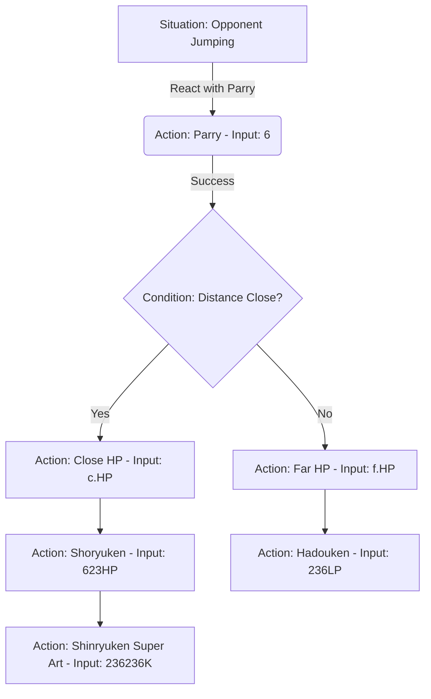

# Combo Flow 🚀🎮
> **Unleash your tactical fighting game potential.** Create, visualize, and map out frame-accurate movement sequences, situational decision trees, and pressure routes with an interactive node-based flowchart canvas.

[](https://vitejs.dev/)
[](https://react.dev/)
[](https://tailwindcss.com/)
[](https://reactflow.dev/)
[](https://www.typescriptlang.org/)
[](https://bun.sh/)
[](https://opensource.org/licenses/MIT)

[Combo FLow](https://combo-flow.vercel.app/)


---

## ⚡ What is Combo Flow?

In fighting games, success is built on split-second decision making, optimal combos, and situational awareness. **Combo Flow** is a specialized flowchart canvas designed for theorycrafters, coaches, and competitive players. It lets you visually construct tactical decision trees for legendary titles like **Street Fighter III: 3rd Strike**.

Instead of writing down combos in complex notation text lines, you can map them dynamically into flows showing exactly what to do when your opponent blocks, jumps, or wakes up.

---

## 🗺️ How it Works (Visualizing a Setup)

Here is a visual representation of how Combo Flow translates fighting game logic into interactive nodes:



---

## ✨ Features Breakdown

* **🕹️ Tactical Starting States:** Start your decision trees from concrete situational points such as:
  * *Opponent in Corner* (Corner setups & traps)
  * *Opponent Jumping* (Anti-air choices)
  * *Wake-up (Oki)* (Meaties, throws, baiting DP)
  * *Neutral Game* (Spacing & pokes)
* **🥋 Character-Specific Movesets:** Select from iconic Third Strike characters (e.g., Ryu, Ken, Necro) and load their movesets dynamically. The system displays correct inputs and maps:
  * Close/Far Normals (e.g., `c.MP`, `f.HP`)
  * Special Moves (e.g., Hadouken, Shoryuken)
  * Super Arts (e.g., Shinryuken, Denjin Hadouken)
  * System mechanics like **Parry (6)**, **Low Parry (2)**, and **Universal Overhead (MP+MK)**.
* **🧠 Custom Node Architecture:**
  * **Situation Nodes (Green):** Represent the state of the match.
  * **Condition Nodes (Amber/Yellow):** Introduce conditional branches (e.g., "Hit?", "Blocked?") with **YES** and **NO** handles for dynamic logic flow.
  * **Action/Move Nodes (Violet):** Detailed boxes containing the name of the move and its frame-accurate input commands.
* **📸 Flowchart Exporting:** Built-in rendering engine utilizing `html-to-image` that takes a high-resolution PNG snapshot of your strategy canvas. Share your setups instantly with your Discord community, Twitter, or coaching students.

---

## 🛠️ Technology Stack

Combo Flow is built using a modern, ultra-fast web development stack:

* **Frontend Library:** [React 19](https://react.dev/) — High performance UI rendering.
* **Canvas Engine:** [@xyflow/react (React Flow)](https://reactflow.dev/) — Interactive panning, zooming, and smooth node connections.
* **CSS Framework:** [Tailwind CSS v4](https://tailwindcss.com/) — Next-generation engine with lightning-fast utility-first compilation.
* **Bundler & Build Tool:** [Vite 7](https://vitejs.dev/) — Fast Hot Module Replacement (HMR) for developer efficiency.
* **Runtime / Package Manager:** [Bun](https://bun.sh/) & `npm` — Used for managing dependencies and running local processes quickly.
* **Iconography:** [Lucide React](https://lucide.dev/) — Clean, crisp vector icons.

---

## 📂 Project Architecture & Map

Below is a structured map of the project files. Click on any file to open it directly:

| File / Directory | Description |
| :--- | :--- |
| 🖥️ **Core Pages & Roots** | |
| [src/App.tsx](file:///home/gabriel/projects/combo-flow/src/App.tsx) | App container managing character select state. |
| [src/main.tsx](file:///home/gabriel/projects/combo-flow/src/main.tsx) | React entrypoint. |
| 🧩 **Canvas & React Flow Components** | |
| [src/components/flowCanvas.tsx](file:///home/gabriel/projects/combo-flow/src/components/flowCanvas.tsx) | Main React Flow canvas with custom handlers, connections, and PNG export logic. |
| [src/components/Sidebar.tsx](file:///home/gabriel/projects/combo-flow/src/components/Sidebar.tsx) | Drag-and-drop dock listing moves, situations, and conditions. |
| [src/components/nodes.tsx](file:///home/gabriel/projects/combo-flow/src/components/nodes.tsx) | custom React Flow nodes (`SituationNode`, `ConditionNode`, `MoveNode`). |
| [src/components/customEdge.tsx](file:///home/gabriel/projects/combo-flow/src/components/customEdge.tsx) | Custom edge logic. |
| 📊 **Moves & Game Logic Data** | |
| [src/data/moves/thirdstrike.ts](file:///home/gabriel/projects/combo-flow/src/data/moves/thirdstrike.ts) | Registry of supported Third Strike characters. |
| [src/data/moves/thirdStrike/ken.ts](file:///home/gabriel/projects/combo-flow/src/data/moves/thirdStrike/ken.ts) | Complete moveset registry for Ken (normals, specials, supers). |
| [src/data/moves/thirdStrike/ryu.ts](file:///home/gabriel/projects/combo-flow/src/data/moves/thirdStrike/ryu.ts) | Complete moveset registry for Ryu. |
| [src/data/moves/thirdStrike/necro.ts](file:///home/gabriel/projects/combo-flow/src/data/moves/thirdStrike/necro.ts) | Complete moveset registry for Necro. |
| [src/data/conditions.ts](file:///home/gabriel/projects/combo-flow/src/data/conditions.ts) | Tactical conditional checks (Hit?, Blocked?, etc.). |
| [src/data/situations.ts](file:///home/gabriel/projects/combo-flow/src/data/situations.ts) | Initial tactical states (Neutral, Wake-up, Corner, etc.). |

---

## 🚀 Getting Started

Ensure you have [Node.js](https://nodejs.org/) (v18+) or [Bun](https://bun.sh/) installed.

### 1. Clone the repository
```bash
git clone https://github.com/gabcosta/combo-flow.git
cd combo-flow
```

### 2. Install dependencies
Using **Bun** (highly recommended for speed):
```bash
bun install
```
Using **npm**:
```bash
npm install
```

### 3. Run in Development Mode
Using **Bun**:
```bash
bun run dev
```
Using **npm**:
```bash
npm run dev
```
Open your browser and navigate to `http://localhost:5173`.

### 4. Build for Production
Using **Bun**:
```bash
bun run build
```
Using **npm**:
```bash
npm run build
```

---

## 🤝 Contributing

We welcome contributions to add more movesets, new game supports, or feature requests!
1. **Fork** the Project.
2. **Create** your Feature Branch (`git checkout -b feature/AmazingFeature`).
3. **Commit** your Changes (`git commit -m 'Add some AmazingFeature'`).
4. **Push** to the Branch (`git push origin feature/AmazingFeature`).
5. **Open** a Pull Request.

---

## 📄 License

Distributed under the MIT License. See `LICENSE` for more information.

Developed with ❤️ by [Gabriel Santos](https://github.com/gabcosta)
